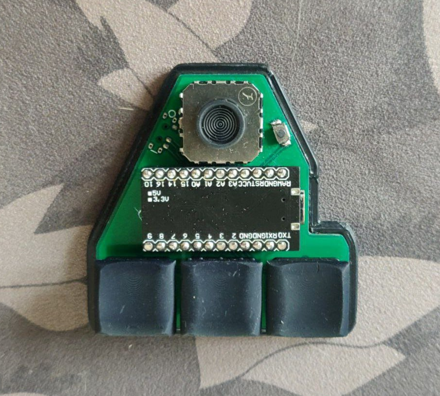

#Anu

[Anu](https://en.wikipedia.org/wiki/Anu) - compact stick mouse.

Gerber files and stl models can be downloaded in [releases](https://github.com/aroum/anu/releases).

# Features
* PSP analog stick 
* 3 keys, Kailh Choc V1 switches
* Choc spacing
* Direct pins 
* Wireless(optional)
* Per switch RGB(optional)
* Power switch for wireless controllers(optional)

# Firmware

Anu can be used with [nRFMicro](https://github.com/joric/nrfmicro) or [nice!nano](https://nicekeyboards.com/nice-nano/) and 301230 batteries for wireless mode. Currently ZMK does not support analog sticks.

The original idea was to create a compact "mouse" ([layout](http://www.keyboard-layout-editor.com/#/gists/458957846f6c65296a02e8bd9ae2c3ca)), but it can also be used as a gamepad. Gamepad firmare use [ArduinoGamepad library](https://github.com/gamelaster/ArduinoGamepad). For more detailed settings of the gamepad, you can use [TocaEdit XBOX 360 CE](https://www.x360ce.com/).

You can use the [threeboard layout](https://github.com/taylorconor/threeboard) to enter text using Anu.

Other configs using the analog stick [1](https://blog.ffff.lt/posts/joystick-algorithms/) & [2](https://github.com/CarrasTec/JoystickQMK/tree/main/macrokrs).

# BOM

| Item                                                                   | Quantity | Remarks                            |
| ---------------------------------------------------------------------- | -------: | ---------------------------------- |
| [proMicro](https://aliexpress.ru/item/32840365436.html)                |        1 | or any other compatible controller |
| [Kailh Choc V1](https://aliexpress.ru/item/32959996455.html)           |        3  switches                            |
| [FJ08K-S](https://aliexpress.ru/item/1005006435837883.html) or [FJ08K](https://aliexpress.ru/item/32979957864.html)    |       1 | analog stick. FJ08K-S has an additional button  |
| [Keycaps](https://aliexpress.ru/item/33026798318.html)                 |       10 | 1U                                 |
| [YS-SK6812MINI-E](https://aliexpress.ru/item/4000475685852.html)       |       10 | RGB leds                           |
| [Magnets](https://aliexpress.ru/item/1005002757445161.html)            |      3-5 | disc 7x2 mm (for case)             |
| [Bumpon](https://aliexpress.ru/item/4001188580018.html)                |        7 | 5x2 mm                             |
| [Sockets PH3.5](https://aliexpress.ru/item/32899635835.html)           |     12x2 | for controller                     |
| [SMD button 3x4x2mm](https://aliexpress.ru/item/1005003812819985.html) |        1 | for reset                          |
| [MSK-12C02](https://aliexpress.ru/item/1005001398386692.html)          |        1 | Power switch  (wireless only)      |
| [301230](https://aliexpress.ru/item/32732458079.html)                  |        1 | Battery  (wireless only)           |

[IBOM](https://htmlpreview.github.io/?https://github.com/aroum/anu/blob/master/pcb/ibom/ibom.html)

# Build guide
1. Solder the controller sockets
2. Solder the power switch (wireless only)
3. Solder the reset button
4. Solder the battery (only for wireless version)
5. Solder analog stick
6. Solder the pins into the controller
7. Solder 3 Kailh Choc V1 switches 
8. Solder 3 LEDs (RGB version only)
9. Put the keycaps on the switches and analog stick
10. Stick bumpon or place the keyboard in the case
11. Insert controller into sockets
12. Flash the bootloader (see the official manual for the controller)
13. Flash the firmware (see the official manual for the controller)

[Soldering Tutorial for Beginners](https://mightyohm.com/files/soldercomic/FullSolderComic_EN.pdf) ([RU version](https://sho0.neocities.org/downloads/komiks_payat_prosto.pdf))