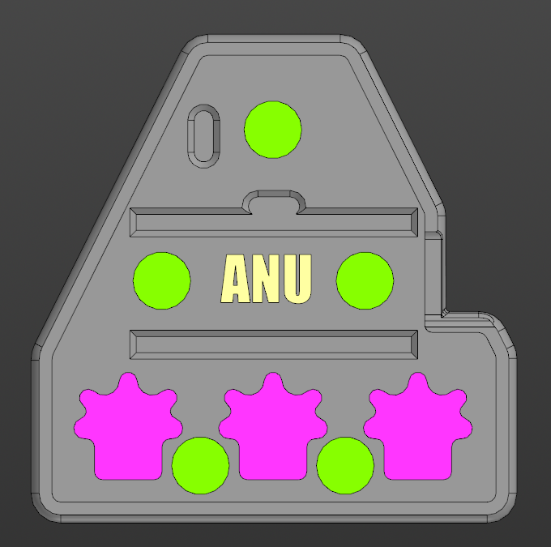
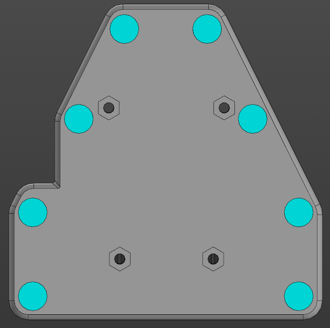

# CASE
 

The pcb is fixed by friction or double-sided tape.

# BOM
* magnets size: 7x2mm (3-5 pcs)
* bumpons size: 5x2mm (8 pcs)
* nuts size: m2 (4 pcs)
* screws size: m2x4 (4 pcs)

# Print options:
* Printer: Voxelab proxima
* Rafts: No
* Supports: Yes
* Resolution: 0.05mm
* Resin material: ABS-like

The flexible version of the body does not have holes for non-slip feet.

STL and STEP models can be downloaded in [releases](https://github.com/aroum/anu/releases).