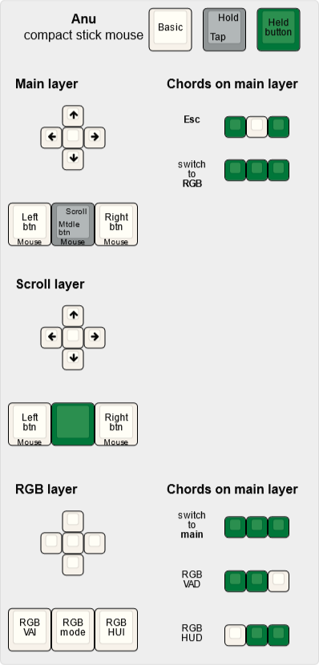

# Firmware

## KLE

[Layout on the KLE website](http://www.keyboard-layout-editor.com/#/gists/458957846f6c65296a02e8bd9ae2c3ca)

## QMK
 


* copy folder QMK/anu to qmk/keyboards
* run ```qmk compile -kb anu -km default```


Or just download in [releases](https://github.com/aroum/anu/releases).

## ZMK

Waiting for adding support mouse and analog read func.

## Arduino
* install [arduino gamepad lib](https://github.com/elanthis/gamepad)
* build
* install [x360ce](https://www.x360ce.com/) [optional]
