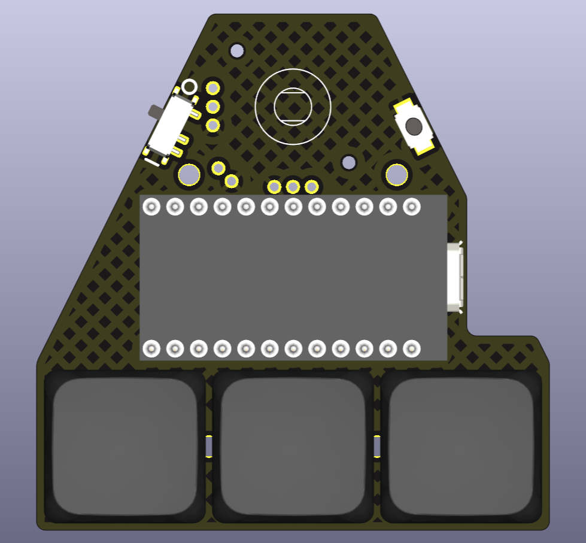

# PCB
 

There is also the option of two PCBs fitted into 100x100 mm.

Gerber files can be downloaded in [releases](https://github.com/aroum/anu/releases).

[IBOM](https://htmlpreview.github.io/?https://github.com/aroum/anu/blob/master/pcb/ibom/ibom.html)
